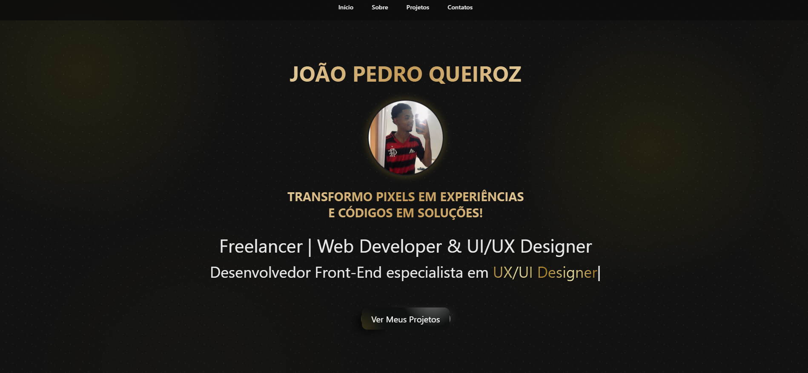

<h1 align="center"> Portfólio Pessoal - João Pedro ⚡🚀 </h1>

<p align="center">
  Meu site pessoal desenvolvido para apresentar meus projetos, habilidades e contato profissional, com design moderno e animações interativas.
</p>

<p align="center">
  <a href="#-tecnologias">Tecnologias</a>&nbsp;&nbsp;&nbsp;|&nbsp;&nbsp;&nbsp;
  <a href="#-features">Funcionalidades</a>&nbsp;&nbsp;&nbsp;|&nbsp;&nbsp;&nbsp;
  <a href="#-layout">Design</a>&nbsp;&nbsp;&nbsp;|&nbsp;&nbsp;&nbsp;
  <a href="#-como-executar">Como Executar</a>
</p>

<br>

<p align="center">
  
</p>

## 🚀 Tecnologias

Este projeto combina a base do desenvolvimento web com bibliotecas de animação para criar uma experiência fluida:

- **HTML5** (Semântica e Acessibilidade)
- **CSS3**
  - **Animações Keyframes** (Efeitos de entrada e flutuação)
  - **Flexbox** (Layout responsivo)
  - **Media Queries** (Adaptação para Mobile/Tablet)
- **JavaScript (ES6+)**
  - **Typed.js** (Efeito de digitação automática no banner principal)
  - **ScrollReveal** (Animação de elementos ao rolar a página)

## ✨ Features

- **Efeito de Digitação:** O título principal alterna dinamicamente entre "Frontend Developer", "YouTuber", etc. (Configurável no `script.js`).
- **Scroll Reveal:** As seções (Sobre, Serviços, Projetos) aparecem suavemente conforme o usuário desce a página.
- **Menu Mobile:** Menu "Hambúrguer" responsivo que funciona perfeitamente em celulares.
- **Formulário de Contato:** Interface estilizada para envio de mensagens.

## 🎨 Design System

O layout segue uma estética **Dark Modern** com acentos em Neon:

- **Cor de Fundo:** `#1f242d` (Cinza Carvão Escuro)
- **Cor de Acento:** `#00eeff` (Ciano Neon) - Usado em botões, sombras (box-shadow) e textos de destaque.
- **Tipografia:** *Poppins* (Fonte moderna e geométrica).

## 📂 Estrutura de Pastas

```bash
portfolio/
├── img/                # Prints dos projetos e assets
├── index.html          # Estrutura principal
├── style.css           # Estilização e Animações CSS
├── script.js           # Lógica do Menu, Typed.js e ScrollReveal
└── README.md           # Documentação
